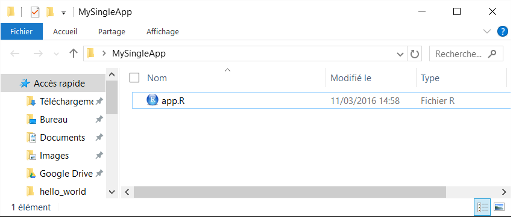
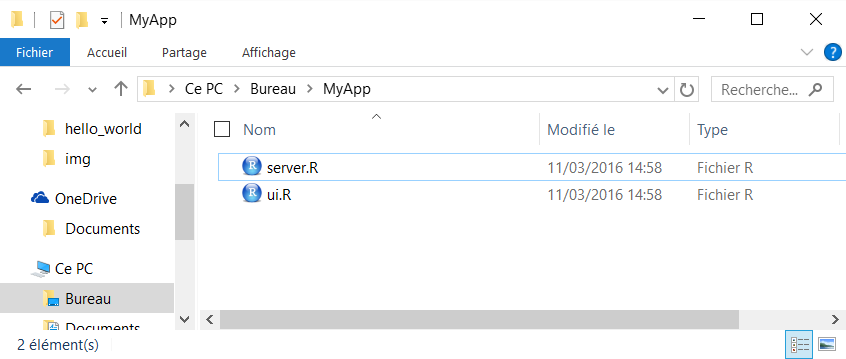
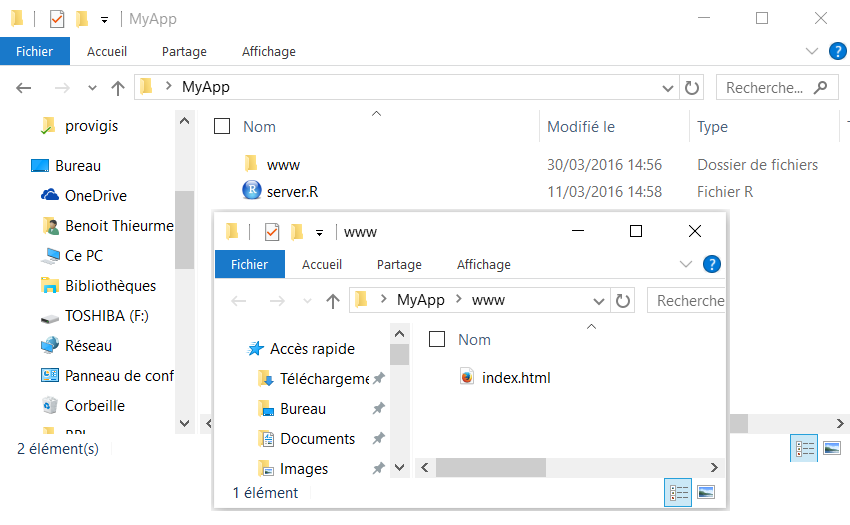
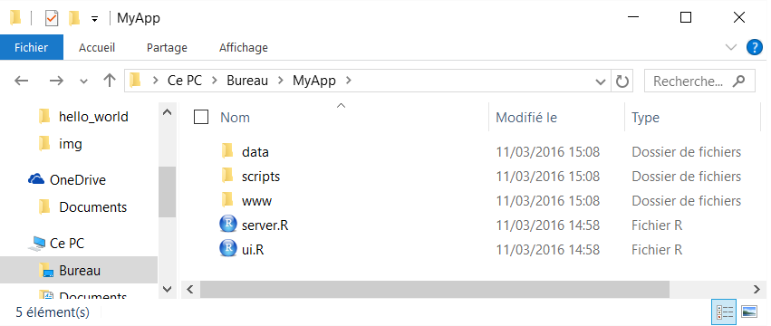

---
output:
  ioslides_presentation:
    css: css/shiny_niv1.css
    highlight: zenburn
    smaller: yes
    transition: slower
    widescreen: yes
runtime: shiny
---

# Structure d'une application

## Structure d'une application

__Un seul fichier...__

- Enregistré sous le nom __app.R__
- Se terminant par la commande shinyApp()
- Pour les applications légères

<div style="text-align:center" markdown="1">

</div>

## Structure d'une application | Un seul fichier

```{r, eval = FALSE}
library(shiny)
ui <- fluidPage(
  sliderInput(inputId = "num", label = "Choose a number", 
              value = 25, min = 1, max = 100),  
  plotOutput("hist")
)
server <- function(input, output) {  
  output$hist <- renderPlot({
    hist(rnorm(input$num))  
  }) 
}
shinyApp(ui = ui, server = server)
```

## Structure d'une application

__Deux fichiers...__

<div class="columns-2">

- FRONT &rarr; __ui.R__ 

  Interface utilisateur
  
  <br/><br/>
  
- BACK &rarr; __server.R__ 

  Calculs et manipulation des données
</div>

<div style="text-align:center" markdown="1">

</div>

## Structure d'une application | Deux fichiers

__ui.R__
```{r, eval = FALSE}
library(shiny)
fluidPage(
  sliderInput(inputId = "num", label = "Choose a number", 
              value = 25, min = 1, max = 100),  
  plotOutput("hist")
)
```

__server.R__
```{r, eval = FALSE}
library(shiny)
function(input, output) {  
  output$hist <- renderPlot({hist(rnorm(input$num))}) 
}
```

## Structure d'une application | UI en HTML

Même si en général on code le __UI__ dans un __script R__, il est également possible de le coder entièrement dans un fichier __.html__. Plus d'informations à cette adresse https://shiny.rstudio.com/articles/html-ui.html

- Côté interface utilisateur, un fichier __index.html__ dans le répertoire ``www``
- Côté serveur dans le script __server.R__

<div style="text-align:center" markdown="1">

</div>


## Structure d'une application | Données/fichiers complémentaires

- L'environnement __R__ (_working directory_) est le chemin de votre application où se trouvent le serveur et l'interface... on peut donc accéder de façon relative à tous les objets présents dans le dossier

&#9787; On peut donc charger tout type de fichiers **.R**, **.RDATA**, **.RDS**, **.csv**, etc.

- L'application web, comme de convention, accède à tous les éléments présents dans le dossier ``www``

<div style="text-align:center" markdown="1">

</div>

## Structure d'une application | Partage ui &harr; server

__Le server et l'ui communiquent uniquement par le biais des inputs et des outputs__

- Nous pouvons ajouter un script nommé **global.R** pour partager des éléments (variables,  packages, ...) entre la partie __UI__ et la partie __SERVER__ 

    - Tout ce qui est présent dans le **global.R** est visible à la fois dans le __ui.R__ et dans le __server.R__

    - Le script **global.R** est chargé uniquement une seul fois au lancement de l'application

- Dans le cas d'une utilisation avec un *shiny-server*, les objets globaux sont également partagés entre les utilisateurs
