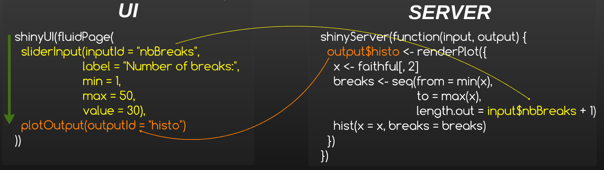
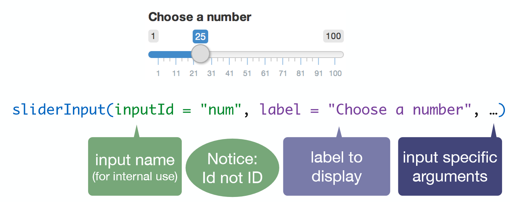

# Intéractivité et communication

## Intéractivité et communication | Premier lancement

```{r, echo = FALSE}
shinyApp(
  ui = fluidPage(
    titlePanel("Hello Shiny!"),
    sidebarLayout(
      sidebarPanel(
        sliderInput("bins",
                    "Number of bins:",
                    min = 1,
                    max = 50,
                    value = 30)
      ),
      mainPanel(
        plotOutput("distPlot")
      )
    )
  ), 
  
  server = function(input, output) {
    
    # Expression that generates a histogram. The expression is
    # wrapped in a call to renderPlot to indicate that:
    #
    #  1) It is "reactive" and therefore should be automatically
    #     re-executed when inputs change
    #  2) Its output type is a plot
    
    output$distPlot <- renderPlot({
      x    <- faithful[, 2]  # Old Faithful Geyser data
      bins <- seq(min(x), max(x), length.out = input$bins + 1)
      # draw the histogram with the specified number of bins
      hist(x, breaks = bins, col = 'darkgray', border = 'white')
    })
  })

```

## Intéractivité et communication | Introduction

<div style="text-align:center" markdown="1">

</div>

__Le serveur et l'interface communiquent uniquement par le biais des inputs et des outputs__

__Par défaut, un output est mis à jour chaque fois qu'un input dont il dépend change__

## Intéractivité et communication | En résumé

#### On défini l'interface utilisateur

Organisation graphique de l'application
  
  - Déclaration des inputs
  - Placement des outputs
  - Ajout de textes, descriptions, images, etc.

#### On implémente la partie serveur/session R

Cœur de calcul de l'application
    
  - Déclaration et calcul des outputs
  - Manipulation des données sous conditionnement d'input(s)
  - Codage **R** standard, etc.

## Intéractivité et communication | Interface

__Deux types d'éléments dans le UI__

- xxInput(inputId = ..., ...):

    * Définit un élément qui permet une action de l'utilisateur
    * Accessible côté serveur avec son identifiant __input$[inputID]__

<div style="text-align:center" markdown="1">

</div>

## Intéractivité et communication | Interface

- xxOutput(ouputId = ...):

    * Fait référence à un output créé et défini côté serveur
    * En général : graphiques et tableaux

<div style="text-align:center" markdown="1">

</div>

## Intéractivité et communication | Serveur

__Définition des outputs dans le serveur__

- renderXX({expr}):

    * Calcule et retourne une sortie, dépendante d'inputs, via une expression __R__

<div style="text-align:center" markdown="1">

</div>

## Intéractivité et communication | Dialogue entre Interface/Serveur

<div style="text-align:center" markdown="1">

</div>

__C'est plus clair ?__
