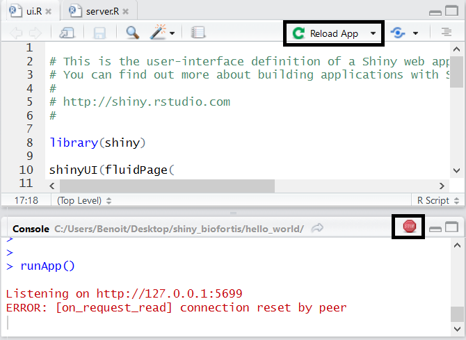

  
## Plan de travail

1. Introduction
2. Intéractivité et communication
3. Structure d'une application
4. Inputs & outputs
5. Structurer sa page / CSS
6. Graphiques intéractifs
7. Expressions réactives
8. Isolation
9. Observe & fonctions d'update
10. Conditionnal Panels
11. Techniques de débogage

## Shiny : créer des applications web avec R

__Shiny__ est un package __R__ qui permet la création simple d'applications web intéractives depuis le logiciel open-source __R__.

Il combine les avantages suivants:

  - Pas de connaissances _web_ nécessaires
  - Pouvoir de calcul de R et l'intéractivité du web actuel
  - Application locales ou partagées avec l'utilisation d'un __shiny-server__

Plus de détails sur __Shiny__ <http://shiny.rstudio.com>.

Plus de détails sur l'utilisation de __shiny-server__ : <https://www.rstudio.com/products/shiny/shiny-server/>.

  

----

Une application __shiny__ nécessite un ordinateur/un serveur éxécutant __R__

  

## Créer une première application avec shiny

- Initialiser une application est simple avec __RStudio__, 
en créant un nouveau projet

    * File > New Project > New Directory > Shiny Web Application

- L'application créée :

    - Repose sur deux scripts : __ui.R__ et __server.R__, ou un seul : __app.R__
    - Utilise par défaut le _sidebar layout_ (détaillé plus tard)

- Commandes utiles :

    * Lancement de l'application : bouton __Run app__
    * Actualisatisation : bouton __Reload app__
    * Arrêt : bouton __Stop__

----
  

  

  
- __Run in Window__ : nouvelle fenêtre, utilisant l'environnement __RStudio__
- __Run in Viewer Pane__ : dans l'onglet _Viewer_ de __RStudio__
- __Run External__ : dans le navigateur web par défaut

----
  

  

