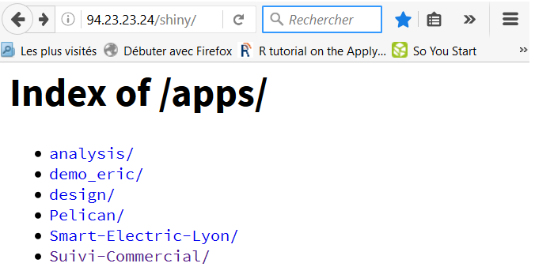
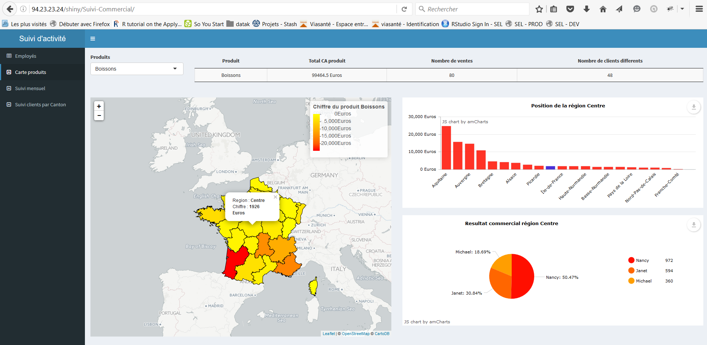

```{r child = 'introduction.Rmd'}
```

```{r child = 'interactivity.Rmd'}
```

```{r child = 'application.Rmd'}
```

```{r child = 'input.Rmd'}
```

```{r child = 'output.Rmd'}
```

```{r child = 'ui_structure.Rmd'}
```

```{r child = 'css.Rmd'}
```

```{r child = 'htmlwidgets.Rmd'}
```

```{r child = 'isolation.Rmd'}
```

```{r child = 'reactive.Rmd'}
```

```{r child = 'observe_update.Rmd'}
```

```{r child = 'conditionnal.Rmd'}
```

```{r child = 'debug.Rmd'}
```

# Quelques bonnes pratiques

## Quelques bonnes pratiques

- Préférer l'underscore (_) au point (.) comme séparateur dans le nom des variables. En effet, le **.** peut amener de mauvaises intérations avec d'autres langages, comme le __JavaScript__
- Faire bien attention à __l'unicité des différents identifiants__ des inputs/outputs
- Pour éviter des problèmes éventuels avec __des versions différentes de packages__, et notamment dans le cas de __plusieurs applications shiny__ et/ou différents environnements de travail, essayer d'utiliser [packrat](https://rstudio.github.io/packrat/)
- Mettre toute la __partie "calcul"__ dans des __fonctions/un package__ et effectuer des tests ([testthat](http://r-pkgs.had.co.nz/tests.html))

## Quelques bonnes pratiques

- Diviser la partie __ui.R__ et __server.R__ en plusieurs scripts, un par onglet par exemple :

```{r, echo = TRUE, eval = FALSE}
# ui.R
shinyUI(
  navbarPage("Divide UI & SERVER",
    source("src/ui/01_ui_plot.R", local = TRUE)$value,
    source("src/ui/02_ui_data.R", local = TRUE)$value
  )
)
# server.R
shinyServer(function(input, output, session) {
  source("src/server/01_server_plot.R", local = TRUE)
  source("src/server/02_server_data.R", local = TRUE)
})
```

# Shiny-server

## Quelques mots sur shiny-server

On peut déployer en interne nos applications shiny en installant un [shiny-server](https://www.rstudio.com/products/shiny/shiny-server2/). 

- Uniquement sur linux : ubuntu 12.04+, RedHat/CentOS 5+, SUSE Enterprise Linux 11+
- Version gratuite : déployer plusieurs applications __shiny__
- Version payante : 
    + Authentification
    + Ressources par applications (nombre de coeurs, mémoire, ...)
    + Monitoring

------

Une fois le serveur installé, il suffit de déposer les applications dans le répertoire dédié, et elles deviennent directement accessibles via l'adresse _server:port_ou_redirection/nom_du_dossier_.

<div style="text-align:center" markdown="1">

</div>

<div style="text-align:center" markdown="1">

</div>

-----

<div style="text-align:center" markdown="1">

</div>

-----

Des logs sont alors disponibles sous la forme de ``print console`` :

<div style="text-align:center" markdown="1">

</div>

# Références

## Références / Tutoriaux / Exemples

* http://shiny.rstudio.com/
* http://shiny.rstudio.com/articles/
* http://shiny.rstudio.com/tutorial/
* http://shiny.rstudio.com/gallery/
* https://www.rstudio.com/products/shiny/shiny-user-showcase/
* http://www.showmeshiny.com/


