\fontfamily{cmr}
\fontsize{11}{15}
\selectfont


# Shiny : créer des applications web avec le logiciel R

__Shiny__ est un package __R__ qui permet la création simple d'applications web intéractives depuis le logiciel open-source __R__.

Il combine les avantages suivants:

  - Pas de connaissances _web_ nécessaires.
  - Pouvoir de calcul de __R__ et l'intéractivité du web actuel.
  - Applications locales ou partagées avec l'utilisation d'un __shiny-server__.

Plus de détails sur:

- __Shiny__ : <http://shiny.rstudio.com>.
- L'utilisation de __shiny-server__: <https://www.rstudio.com/products/shiny/shiny-server/>.

Comme illustré sur la figure \ref{server_R}, \pageref{server_R}, une application __shiny__ nécessite un ordinateur/serveur éxécutant des instructions __R__. La communication avec l'interface utilisateur se fait par l'intermédiaire d'identifiants. 

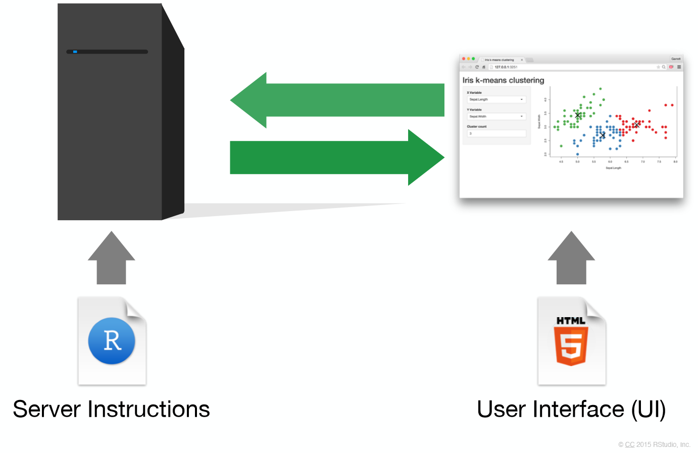


# Créer une première application avec shiny

- Initialiser une application est simple avec __RStudio__, 
en créant un nouveau projet

    * File > New Project > New Directory > Shiny Web Application

- L'application créée :

    - Repose sur deux scripts : __ui.R__ et __server.R__.
    - Utilise par défaut le _sidebar layout_ (détaillé plus tard)

Lors du développement, R Studio fournit des boutons utiles :

- Lancement de l'application : bouton __Run app__

    - \og Run in Window \fg : Nouvelle fenêtre, utilisant l'environnement __RStudio__
    - \og Run in Viewer Pane \fg : Dans l'onglet _Viewer_ de __RStudio__
    - \og Run External \fg : Dans le navigateur web par défaut
- Actualisation : bouton __Reload app__
- Arrêt : bouton __Stop__


```{r, out.width='80%', dpi=220, fig.align='center', echo=FALSE}
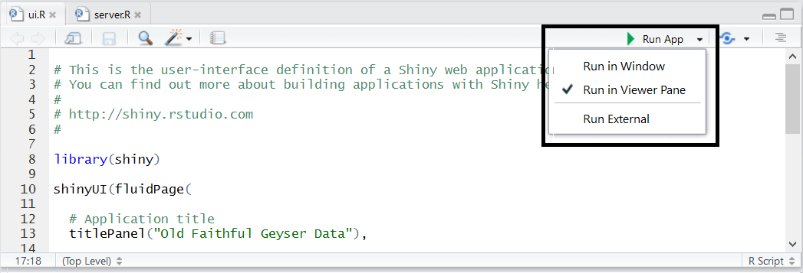
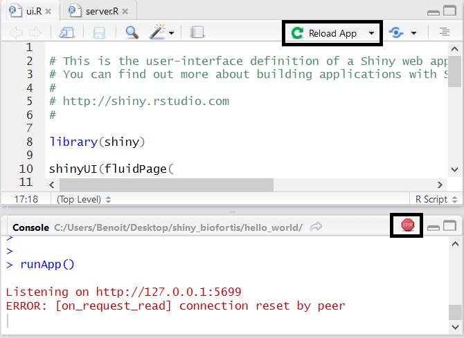
```

# Intéractivité et communication

## Structure d'une application

Lorsque vous créez un projet Shiny depuis R Studio, deux scripts nommés _ui.R_ et _server.R_.

- On lance l'application avec l'instruction `shiny::runApp(appDir)`

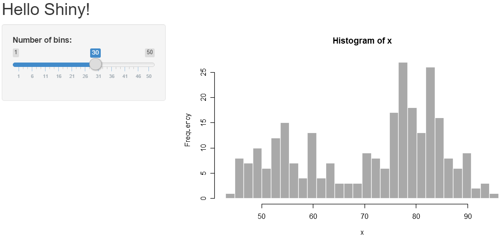

## Principes fondamentaux

__La définition de l'interface utilisateur : ui.R__

  - Déclaration des inputs
  - Placement des outputs
  - Ajout de textes, descriptions, images, etc.

__La partie serveur/calculs : server.R__

  - Déclaration et calcul des outputs.
  - Manipulation des données sous conditionnement d'input(s).
  - Codage **R** standard, etc.

## Interface: ui.R 

__Deux types d'éléments__

- xxInput(inputId = ..., ...) :

    * définit un élément qui permet une action de l'utilisateur ;
    * accessible côté serveur avec son identifiant __input$inputID__.

```{r, out.width='50%', dpi=220, fig.align='center', echo=FALSE}
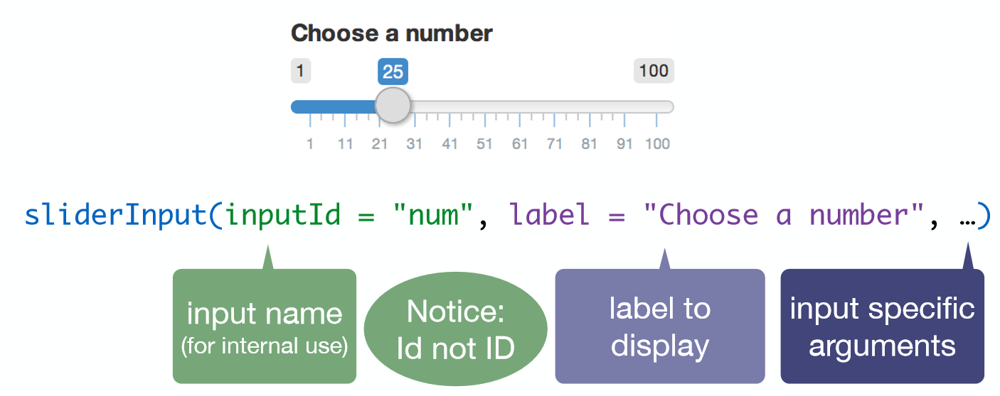
```

- xxOutput(ouputId = ...) :

    * fait référence à un output créé et défini côté serveur ;
    * en général : graphiques et tableaux.

```{r, out.width='40%', dpi=220, fig.align='center', echo=FALSE}
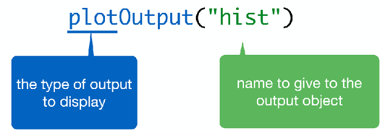
```

## Serveur: server.R

Le serveur manipule deux liste __input__, __output__. La définition des output se fait à l'aide des fonctions `renderXX({expr})`. À l'intérieur de ces fonctions, on calcule et retourne une sortie, dépendante d'input(s), via une expression __R__.

```{r, out.width='50%', dpi=220, fig.align='center', echo=FALSE}
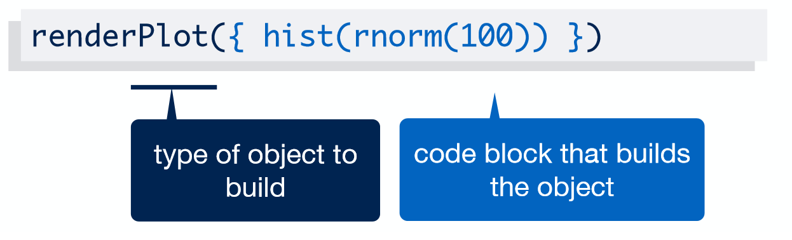
```

## Global : global.R

Nous pouvons ajouter un script nommé **global.R** pour partager des éléments (variables,  packages, ...) entre la partie __ui__ et la partie __server__ 

- Tout ce qui est présent dans le **global.R** est visible à la fois dans le __ui.R__ et dans le __server.R__

- Le script **global.R** est chargé uniquement une seule fois au lancement de l'application

- Si l'application est utilisée par plusieurs personnes en même temps les objet définis dans **global.R** sont commmuns à tous.


## Partage ui <-> server

__Le server et l'ui communiquent uniquement par le biais des inputs et des outputs__


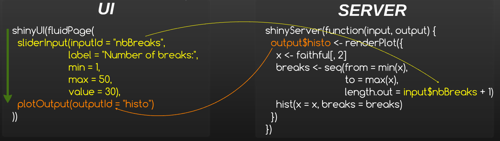

Quelques remarques importantes : 
    
  -  \og Interface - __ui.R__\fg{}  et \og Serveur - __server.R__\fg{} communiquent uniquement par le biais des inputs et des outputs.
  - Par défaut, un output est mis à jour chaque fois qu'un input en lien change.


### Exemple de présentation

**ui.R**:

```{r, eval = FALSE}
library(shiny)
shiny::run
# Define UI for application that draws a histogram
shinyUI(fluidPage(
  # Application title
  titlePanel("Hello Shiny!"),
  # Sidebar with a slider input for the number of bins
  sidebarLayout(
    sidebarPanel(
      sliderInput(inputId = "bins", 
                  label = "Number of bins:",
                  min = 1, max = 50, value = 30)
    ),
    # Show a plot of the generated distribution
    mainPanel(plotOutput(outputId = "distPlot"))
  )
))
```

**server.R**:

```{r, eval = FALSE}
library(shiny)

# Define server logic required to draw a histogram
shinyServer(function(input, output) {
  # Expression that generates a histogram. The expression is
  # wrapped in a call to renderPlot to indicate that:
  #
  #  1) It is "reactive" and therefore should be automatically
  #     re-executed when inputs change
  #  2) Its output type is a plot
  output$distPlot <- renderPlot({
    x    <- faithful[, 2]  # Old Faithful Geyser data
    bins <- seq(min(x), max(x), length.out = input$bins + 1)
    # draw the histogram with the specified number of bins
    hist(x, breaks = bins, col = 'darkgray', border = 'white')
  })
})
```

Cet exemple simple nous permet de déduire le fonctionnement suivant :

- Côté **ui**, nous définissons un slider numérique avec le code  \og `sliderInput(inputId = "bins",...)` \fg{} et on utilise sa valeur côté **server** avec la notation  \og `input$bins` \fg :  c'est comme cela que l'**ui** créé des variables disponibles dans le **server** !

- Côté **server**, nous créons un graphique \og `output$distPlot <- renderPlot({...})` \fg{} et l'appelons dans l' **ui** avec  \og `plotOutput(outputId = "distPlot")` \fg : c'est comme cela que le **server** retourne des objets à l'**ui** !


# Structurer sa page

## Organisation 1/3 - 2/3: \og`sidebarLayout`\fg

Le template basique `sidebarLayout` divise la page en deux colonnes et doit contenir obligatoirement :

- `sidebarPanel`, à gauche, en général pour les inputs ;

- `mainPanel`, à droite, en général pour les outputs.

```{r , echo = TRUE, eval = FALSE}
shinyUI(fluidPage(
  titlePanel("Old Faithful Geyser Data"), # title
  sidebarLayout(
    sidebarPanel("SIDEBAR"),
    mainPanel("MAINPANEL")
  )
))
```


```{r, out.width='80%', dpi=220, fig.align='center', echo=FALSE}
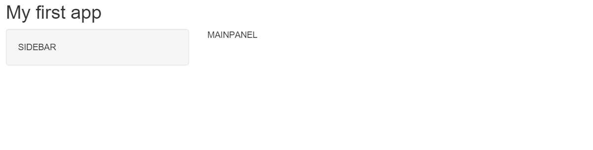
```

## Contenu grisé : \og`wellPanel`\fg

Comme avec le ``sidebarPanel`` précédent, on peut griser un ensemble d'éléments en utilisant un ``wellPanel`` :

```{r , echo = TRUE, eval = FALSE}
shinyUI(fluidPage(
  titlePanel("Old Faithful Geyser Data"), # title
  wellPanel(
    sliderInput("num", "Choose a number", value = 25, min = 1, max = 100),  
    textInput("title", value = "Histogram", label = "Write a title")
  ),
  plotOutput("hist")
))
```


```{r, out.width='80%', dpi=220, fig.align='center', echo=FALSE}
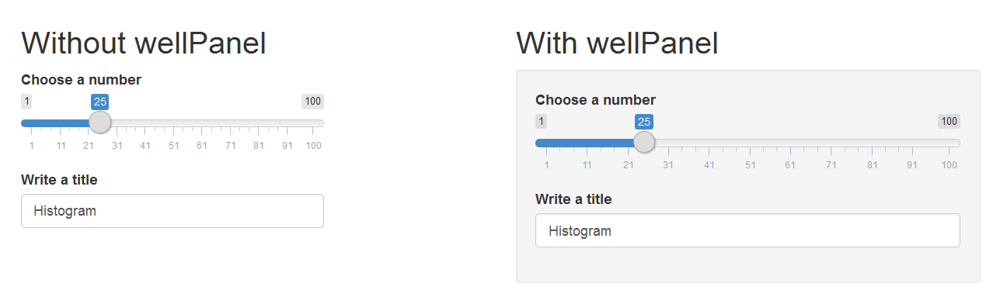
```

## Page à onglets: \og`navbarPage`\fg

Utiliser une barre de navigation et des onglets avec `navbarPage` et `tabPanel`:

```{r , echo = TRUE, eval = FALSE}
shinyUI(
  navbarPage(
    title = "My first app",
    tabPanel(title = "Summary",
             "Here is the summary"),
    tabPanel(title = "Plot",
             "some charts"),
    tabPanel(title = "Table",
             "some tables")
  )
)
```


Nous pouvons rajouter un second niveau de navigation avec un `navbarMenu` : 

```{r , echo = TRUE, eval = FALSE}
shinyUI(
  navbarPage(
    title = "My first app",
    tabPanel(title = "Summary",
             "Here is the summary"),
    tabPanel(title = "Plot",
             "some charts"),
    navbarMenu("Table",
               tabPanel("Table 1"),
               tabPanel("Table 2")
    )
  )
)
```

```{r, out.width='80%', dpi=220, fig.align='center', echo=FALSE}
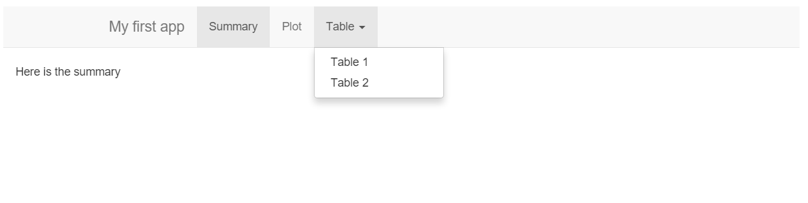
```

## Organisation du contenu en onglets: \og`tabsetPanel`\fg

Plus généralement, nous pouvons créer des onglets à n'importe quel endroit en utilisant `tabsetPanel` & `tabPanel`:

```{r , echo = TRUE, eval = FALSE}
shinyUI(fluidPage(
  titlePanel("Old Faithful Geyser Data"), # title
  sidebarLayout(
    sidebarPanel("SIDEBAR"),
    mainPanel(
      tabsetPanel(
        tabPanel("Plot", plotOutput("plot")), 
        tabPanel("Summary", verbatimTextOutput("summary")), 
        tabPanel("Table", tableOutput("table"))
      )
    )
  )
))
```

```{r, out.width='80%', dpi=220, fig.align='center', echo=FALSE}
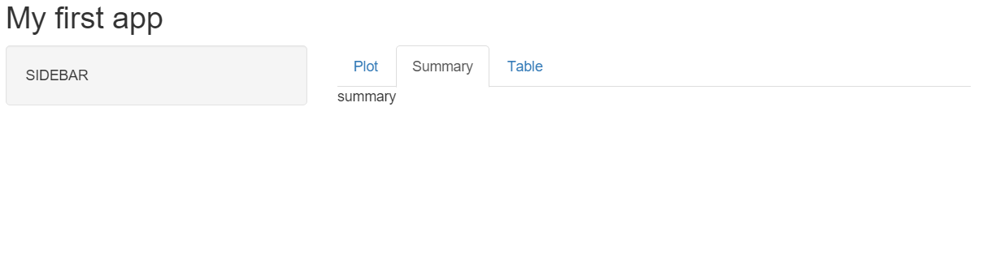
```

## Onglets verticaux: \og`navlistPanel`\fg

Une alternative au `tabsetPanel`, pour une disposition verticale plutôt qu'horizontale : ``navlistPanel``.

```{r , echo = TRUE, eval = FALSE}
shinyUI(fluidPage(
  navlistPanel(
    tabPanel("Plot", plotOutput("plot")), 
    tabPanel("Summary", verbatimTextOutput("summary")), 
    tabPanel("Table", tableOutput("table"))
  )
))
```

```{r, out.width='80%', dpi=220, fig.align='center', echo=FALSE}
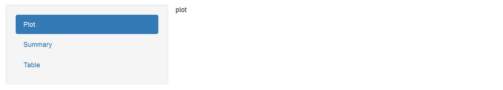
```

## Diviser pour mieux organiser : \og Grid Layout \fg

Créer sa propre organisation avec `fluidRow()` et `column()`. Une seule règle à respecter : **chaque ligne peut être divisée en 12 colonnes**. 

Le dimensionnement final de la page est automatique en fonction des éléments dans les lignes / colonnes

Ce principe, très simple, est à respecter avec rigueur (et indentation de préférence) :

```{r , echo = TRUE, eval = FALSE}
tabPanel(title = "Summary",
         # A fluid row can contain from 0 to 12 columns
         fluidRow(
           # A column is defined necessarily
           # with its argument "width"
           column(width = 4, "column 1"),
           column(width = 4, "column 2"),
           column(width = 4, "column 3"),
         ))
```


```{r, out.width='80%', dpi=220, fig.align='center', echo=FALSE}
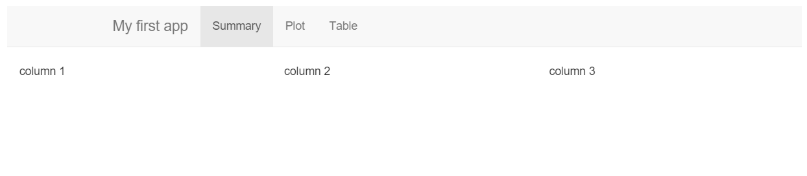
```

## Inclure du des balises HTML

De nombreuses de balises __html__ sont disponibles avec les fonctions ``tags`` :

```{r, echo = TRUE}
names(shiny::tags)
```

```{r, out.width='80%', dpi=220, fig.align='center', echo=FALSE}
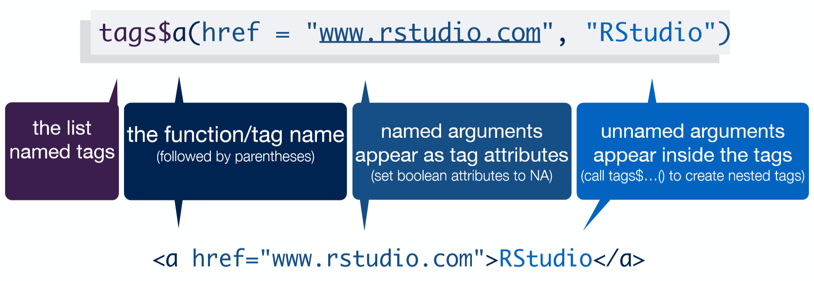
```

C'est également possible de passer du code __HTML__ directement en utilisant la fonction du même nom :

```{r, eval = FALSE}
fluidPage(
  HTML("<h1>My Shiny App</h1>") 
)
```

## Créer facilement des tableaux de bord : \og shinydashboard \fg

Le package \og`shinydashboard`\fg{} (https://rstudio.github.io/shinydashboard/) propose d'autres fonctions pour créer des tableaux de bord :

```{r, out.width='80%', dpi=220, fig.align='center', echo=FALSE}
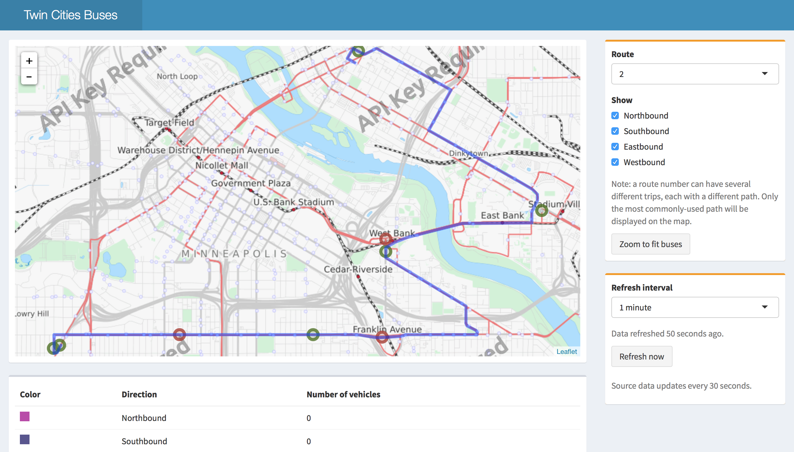
```

## Combiner les structures

Toutes les structures peuvent s'utiliser en même temps !

```{r, out.width='80%', dpi=220, fig.align='center', echo=FALSE}
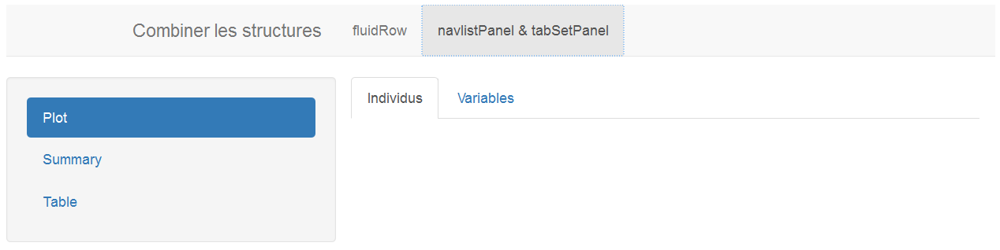
```


# Les inputs

```{r, dpi=220, echo=FALSE}
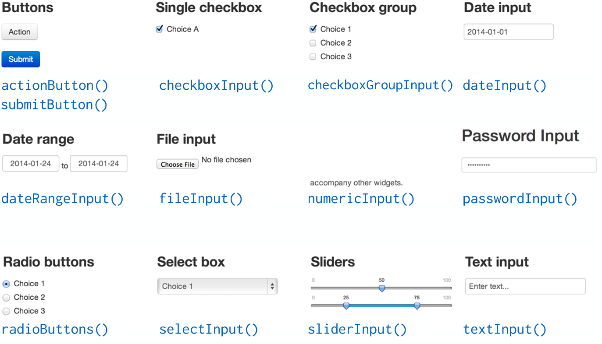
```

Dans la suite, nous donnons une liste non exhaustive de widgets disponibles. Il s'agit d'élements de base très largement utilisés par les développeurs dans le cadre d'applications simples ou complexes.

## Valeur numérique

- La fonction :

```{r, echo = TRUE, eval = FALSE}
numericInput(inputId, label, value, min = NA, max = NA, step = NA)
```

- Exemple :

```{r, echo = TRUE, eval = FALSE}
numericInput(inputId = "idNumeric", label = "Please select a number", 
             value = 0, min = 0, max = 100, step = 10)

# For the server input$idNumeric will be of class "numeric"
# ("integer" when the parameter step is an integer value)
```

```{r, out.width='50%', dpi=220, fig.align='center', echo=FALSE}
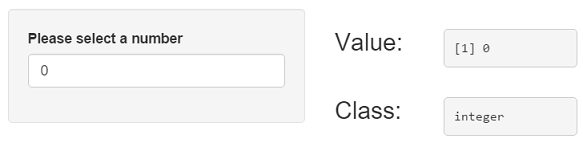
```


## Chaîne de caractères

- La fonction :
```{r, echo = TRUE, eval = FALSE}
textInput(inputId, label, value = "")

```

- Exemple :
```{r, echo = TRUE, eval = FALSE}
textInput(inputId = "idText", label = "Enter a text", value = "")

# For the server input$idText will be of class "character" 
```

```{r, out.width='50%', dpi=220, fig.align='center', echo=FALSE}
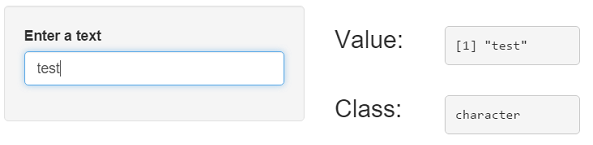
```

## Case de validation

- La fonction :

```{r, echo = TRUE, eval = FALSE}
checkboxInput(inputId, label, value = FALSE)
```

- Exemple :

```{r, echo = TRUE, eval = FALSE}
checkboxInput(inputId = "idCheck1", label = "Check ?")

# For the server input$idCheck1 is of class "logical"
```

```{r, out.width='50%', dpi=220, fig.align='center', echo=FALSE}
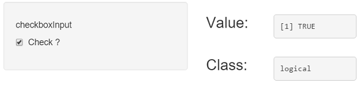
```

## Bouton d'activation

- La fonction :

```{r, echo = TRUE, eval = FALSE}
actionButton(inputId, label, icon = NULL, ...)
```

- Exemple :

```{r, echo = TRUE, eval = FALSE}
actionButton(inputId = "idActionButton", label = "Click !", 
             icon = icon("hand-spock-o"))

# For the server input$idActionButton is an "integer"
```

```{r, out.width='50%', dpi=220, fig.align='center', echo=FALSE}
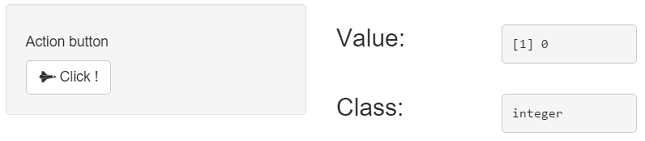
```

## Sélection: valeur(s), date, nombre

### Liste de sélection

- La fonction :

```{r, echo = TRUE, eval = FALSE}
selectInput(inputId, label, choices, selected = NULL, multiple = FALSE,
            selectize = TRUE, width = NULL, size = NULL)
```

- Exemple :

```{r, echo = TRUE, eval = FALSE}
selectInput(inputId = "idSelect", label = "Select among the list: ", selected = 3,
            choices = c("First" = 1, "Second" = 2, "Third" = 3))

# For the server input$idSelect is of class "character"
# (vector when the parameter "multiple" is TRUE)
```

```{r, out.width='50%', dpi=220, fig.align='center', echo=FALSE}
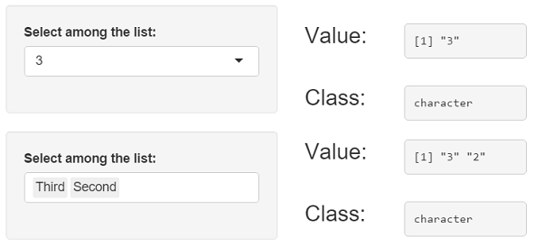
```

### Cases à choix multiples

- La fonction :

```{r, echo = TRUE, eval = FALSE}
checkboxGroupInput(inputId, label, choices, selected = NULL, inline = FALSE)

```

- Exemple :

```{r, echo = TRUE, eval = FALSE}
checkboxGroupInput(inputId = "idCheckGroup", label = "Please select", selected = 3,
                   choices = c("First" = 1, "Second" = 2, "Third" = 3))

# For the server input$idCheckGroup is a "character" vector
```

```{r, out.width='50%', dpi=220, fig.align='center', echo=FALSE}
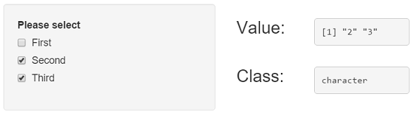
```

### Bouton de sélection

- La fonction :

```{r, echo = TRUE, eval = FALSE}
radioButtons(inputId, label, choices, selected = NULL, inline = FALSE)
```

- Exemple :

```{r, echo = TRUE, eval = FALSE}
radioButtons(inputId = "idRadio", label = "Select one", selected = 3,
             choices = c("First" = 1, "Second" = 2, "Third" = 3))

# For the server input$idRadio is a "character"
```

```{r, out.width='50%', dpi=220, fig.align='center', echo=FALSE}
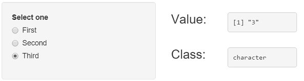
```

### Sélecteur de date

#### Jour unique

- La fonction :

```{r, echo = TRUE, eval = FALSE}
dateInput(inputId, label, value = NULL, min = NULL, max = NULL, format = "yyyy-mm-dd", 
          startview = "month", weekstart = 0, language = "en")
```

- Exemple :

```{r, echo = TRUE, eval = FALSE}
dateInput(inputId = "idDate", label = "Please enter a date", value = "12/08/2015",
          format = "dd/mm/yyyy", startview = "month", weekstart = 0, language = "fr")

# For the server input$idDate is a "Date"
```

```{r, out.width='50%', dpi=220, fig.align='center', echo=FALSE}
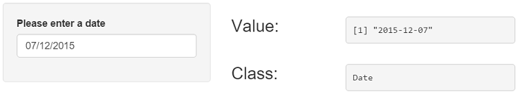
```

#### Période

- La fonction :

```{r, echo = TRUE, eval = FALSE}
dateRangeInput(inputId, label, start = NULL, end = NULL, min = NULL, max = NULL,
               format = "yyyy-mm-dd", startview = "month", weekstart = 0,
               language = "en", separator = " to ")
```

- Exemple :

```{r, echo = TRUE, eval = FALSE}
dateRangeInput(inputId = "idDateRange", label = "Please Select a date range",
               start = "2015-01-01", end = "2015-08-12", format = "yyyy-mm-dd",
               language = "en", separator = " to ")

# For the server input$idDateRange is a vector of class "Date" with two elements
```

```{r, out.width='60%', dpi=220, fig.align='center', echo=FALSE}
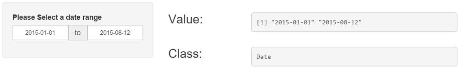
```

### Sélecteur numérique

#### Valeur unique

- La fonction :

```{r, echo = TRUE, eval = FALSE}
sliderInput(inputId, label, min, max, value, step = NULL, round = FALSE,
            format = NULL, locale = NULL, ticks = TRUE, animate = FALSE,
            width = NULL, sep = ",", pre = NULL, post = NULL)
```

- Exemple :

```{r, echo = TRUE, eval = FALSE}
sliderInput(inputId = "idSlider1", label = "Select a number", min = 0, max = 10, 
            value = 5, step = 1)

# For the server input$idSlider1 is a "numeric"
# (integer when the parameter "step" is an integer too)
```

```{r, out.width='50%', dpi=220, fig.align='center', echo=FALSE}
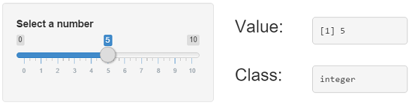
```

#### Intervalle

- La fonction :

```{r, echo = TRUE, eval = FALSE}
sliderInput(inputId, label, min, max, value, step = NULL, round = FALSE,
            format = NULL, locale = NULL, ticks = TRUE, animate = FALSE,
            width = NULL, sep = ",", pre = NULL, post = NULL)
```

- Exemple :

```{r, echo = TRUE, eval = FALSE}
sliderInput(inputId = "idSlider2", label = "Select a number", min = 0, max = 10, 
            value = c(2,7), step = 1)

# For the server input$idSlider2 is a "numeric" vector
# (integer when the parameter "step" is an integer too)
```

```{r, out.width='50%', dpi=220, fig.align='center', echo=FALSE}
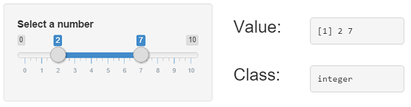
```

## Import d'un fichier

- La fonction :

```{r, echo = TRUE, eval = FALSE}
fileInput(inputId, label, multiple = FALSE, accept = NULL)
```

- Exemple :

```{r, echo = TRUE, eval = FALSE}
fileInput(inputId = "idFile", label = "Select a file")

# For the server input$idFile is a "data.frame" with four "character" columns
# (name, size, type and datapath) and one row
```

```{r, out.width='70%', dpi=220, fig.align='center', echo=FALSE}
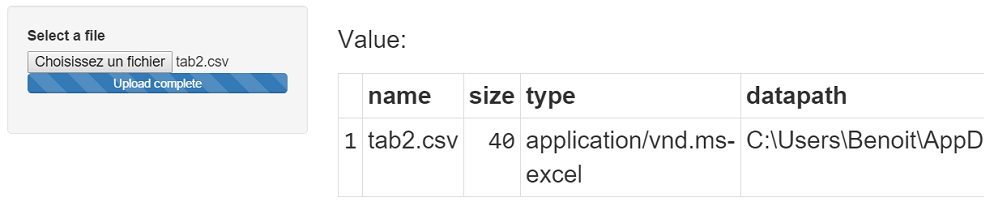
```

## Aller plus loin : construire son propre input

Avec un peu de compétences en HTML/CSS/JavaScript, il est également possible de construire des inputs personnalisés. Un tutoriel est disponible à l'adresse suivante  http://shiny.rstudio.com/articles/building-inputs.html.

De même, deux applications sont données à titre d'exemples : 

- http://shiny.rstudio.com/gallery/custom-input-control.html
- http://shiny.rstudio.com/gallery/custom-input-bindings.html

# Outputs

```{r, out.width='80%', dpi=220, fig.align='center', echo=FALSE}
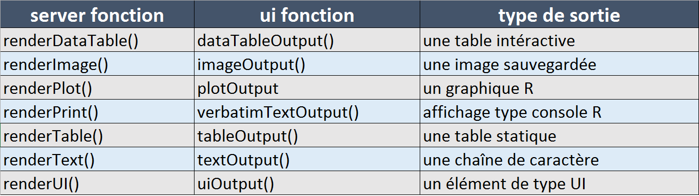
```

Les bonnes règles de construction :

- Assigner l'output à afficher dans la liste __output__, avec un nom permettant l'identification côté __UI__.
- Utiliser une fonction __renderXX({expr})__.
- __La dernière expression doit correspondre au type d'objet retourné__.
- Accéder aux inputs, et contôler la réactivité, en utilisant la liste __input__ et l'identifiant : __input$inputId__.

```{r, echo = TRUE, eval = FALSE}
# ui.R
selectInput("lettre", "Lettres:", LETTERS[1:3])
verbatimTextOutput(outputId = "selection")
# server.R
output$selection <- renderPrint({input$lettre})
```

## Texte

### Affichage simple

- __ui.r__:

```{r, echo = TRUE, eval = FALSE}
textOutput(outputId = "texte")
```

- __server.r__:

```{r, echo = TRUE, eval = FALSE}
output$texte <- renderText({
  c("Hello shiny !")
})
```

```{r, out.width='80%', dpi=220, fig.align='center', echo=FALSE}
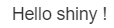
```

### Affichage brute - Résultat console

- __ui.r__:

```{r, echo = TRUE, eval = FALSE}
verbatimTextOutput(outputId = "texte")
```

- __server.r__:

```{r, echo = TRUE, eval = FALSE}
output$texte <- renderPrint({
  c("Hello shiny !")
})
```

```{r, out.width='80%', dpi=220, fig.align='center', echo=FALSE}
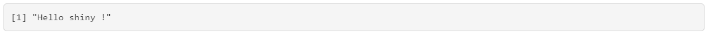
```

## Graphique

- __ui.r__: 

```{r, echo = TRUE, eval = FALSE}
plotOutput("myplot")
```

- __server.r__:

```{r, echo = TRUE, eval = FALSE}
output$myplot <- renderPlot({
  hist(iris$Sepal.Length)
})
```

```{r, out.width='80%', dpi=220, fig.align='center', echo=FALSE}
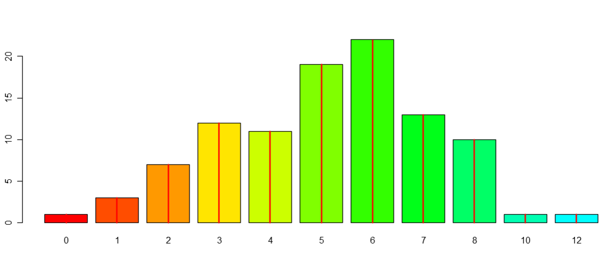
```

## Tableau

### Tableau simple : \og `table`\fg

- __ui.r__:

```{r, eval=FALSE}
tableOutput(outputId = "table")
```

- __server.r__:

```{r, eval=FALSE}
output$table <- renderTable({iris})
```

```{r, out.width='80%', dpi=220, fig.align='center', echo=FALSE}
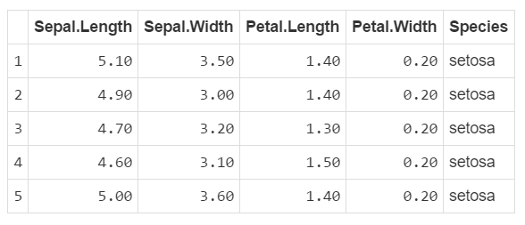
```

### Tableau avancé : \og`dataTable`\fg

- __ui.r__:

```{r, eval=FALSE}
dataTableOutput(outputId = "dataTable")
```

- __server.r__:

```{r, eval=FALSE}
output$dataTable <- renderDataTable({
  iris
})
```

```{r, out.width='80%', dpi=220, fig.align='center', echo=FALSE}
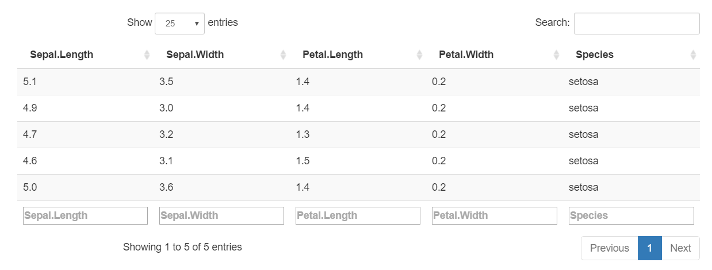
```

## Définir des élements de l'UI côté SERVER

Dans certains cas, nous souhaitons définir des inputs ou des structures côté server.

L'exemple typique étant de créer un input dépendant d'un fichier utilisateur, comme lister les colonnes présentes dans un tableau chargé dans le server. Cela est possible avec les fonctions `uiOutput` et `renderUI`.

### Exemple simple

- __ui.r__: 
```{r, echo = TRUE, eval = FALSE}
uiOutput(outputId = "columns")
```
- __server.r__:
```{r, echo = TRUE, eval = FALSE}
output$columns <- renderUI({
  selectInput(inputId = "sel_col", label = "Column", choices = colnames(data))
})
```

```{r, out.width='80%', dpi=220, fig.align='center', echo=FALSE}
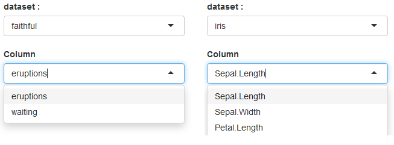
```

### Exemple plus complexe

On peut également renvoyer un élément plus complexe de l'UI, par exemple tout un ``layout`` ou une ``fluidRow``.

- __ui.r__: 
```{r, echo = TRUE, eval = FALSE}
uiOutput(outputId = "fluidRow_ui")
```

- __server.r__:
```{r, echo = TRUE, eval = FALSE}
output$fluidRow_ui <- renderUI(
  fluidRow(
    column(width = 3, h3("Value:")),
    column(width = 3, h3(verbatimTextOutput(outputId = "slinderIn_value")))
  )
)
```

## Aller plus loin : construire son propre output

Avec un peu de compétences en HTML/CSS/JavaScript, il est également possible de construire des outputs personnalisés.

Un tutoriel est disponible : (http://shiny.rstudio.com/articles/building-outputs.html).

On peut donc par exemple ajouter comme output un graphique construit avec la librairie d3.js (https://d3js.org/). Un exemple est disponible dans le dossier ``shinyApps/build_output``.

# Customisation avec des propriétés CSS

__Shiny__ utilise [Bootstrap](http://getbootstrap.com/) pour la partie CSS (Custom StyleSheet). À l'image du développement web \og classique \fg, nous pouvons modifier la feuille de style de trois façons :

- en faisant un lien vers un fichier .css externe, en ajoutant des feuilles de style dans le répertoire ``www`` ;
- en ajoutant du CSS dans l'en tête HTML ;
- en écrivant individuellement du CSS aux éléments.

Il y a une notion d'ordre et de priorité sur ces trois informations : le CSS \og individuel\fg{} l'emporte sur le CSS du header, qui l'emporte sur le CSS externe.

NB: On peut aussi utiliser le package _shinythemes_ (http://rstudio.github.io/shinythemes).

## Avec un fichier _.css_ externe

On peut par exemple télécharger un thème sur _bootswatch_ (http://bootswatch.com/). Il y a deux façons pour le renseigner dans l'application : soit avec argument ``theme`` dans ``fluidPage``, soit avec une balise HTML (``tags$head`` et/ou ``tags$link``).

```{r, eval = FALSE}
library(shiny)
ui <- fluidPage(theme = "mytheme.css",
                # ou avec un tags
                tags$head(
                  tags$link(rel = "stylesheet", type = "text/css",
                            href = "mytheme.css")
                ),
                # reste de l'application
)
```

```{r, out.width='80%', dpi=220, fig.align='center', echo=FALSE}
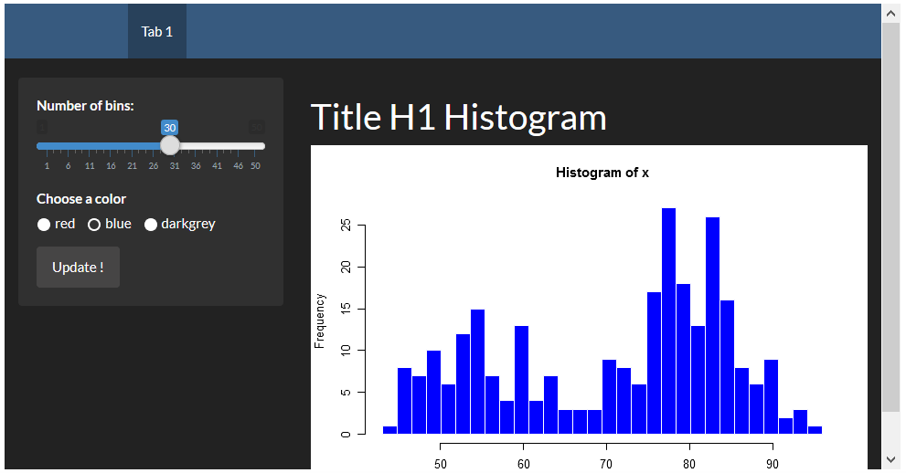
```

## Ajout de propriétés dans l'en-tête

Les propriétés CSS inclues dans l'en-tête seront prioritaires sur celles présentes dans le fichier CSS externe. On utilise pour cela les tags HTML : ``tags$head`` et ``tags$style``.

Il est conseillé de ne pas surcharger l'en-tête pour préserver la lisibilité et le débogage (et la factorisation). Ce genre d'ajout est recommandé uniquement en cas de modification ponctuelle et non pour définir une charte graphique complète.

```{r, eval = FALSE}
library(shiny)
tags$head(
  tags$style(HTML("h1 { color: #48ca3b;}")
  )
)
```

```{r, out.width='80%', dpi=220, fig.align='center', echo=FALSE}
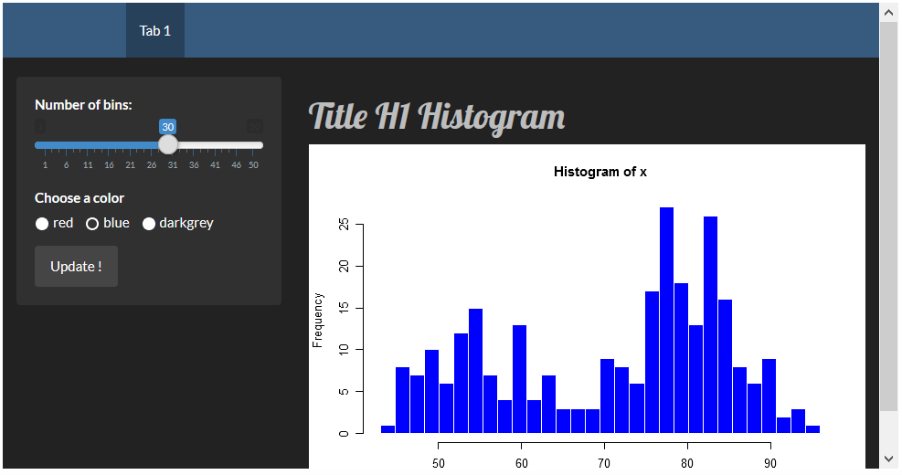
```

## Modifier les propriétés d'un élément unique

Pour finir, on peut également passer directement des propriétés CSS aux éléments HTML :

```{r, eval = FALSE}
library(shiny)
h1("Mon titre", style = "color: #48ca3b;")
```

```{r, out.width='80%', dpi=220, fig.align='center', echo=FALSE}
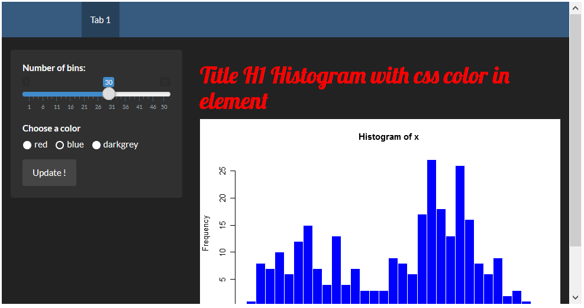
```


# Les atouts d'une application moderne: graphiques intéractifs

Avec notamment l'arrivée du package _htmlwidgets_ (http://www.htmlwidgets.org/), de plus en plus de fonctionnalités tirées des librairies Javascript sont accessibles sous __R__ : 

* _dygraphs_ (time series) (http://rstudio.github.io/dygraphs/)
* _DT_ (interactive tables) (http://rstudio.github.io/DT/)
* _Leafet_ (maps) (http://rstudio.github.io/leaflet/)
* _d3heatmap_ (https://github.com/rstudio/d3heatmap)
* _threejs_ (3d scatter & globe) (http://bwlewis.github.io/rthreejs)
* _rAmCharts_ (http://datastorm-open.github.io/introduction_ramcharts/)
* _visNetwork_ (http://datastorm-open.github.io/visNetwork)
* De nombreux autres exemples sont disponibles dans la galerie suivante http://gallery.htmlwidgets.org/.

## Utilisation dans shiny

Tous ces packages sont utilisables simplement dans __shiny__. En effet, ils contiennent les deux fonctions nécessaires : 

- __renderXX__
- __xxOutput__

Par exemple avec le package  _dygraphs_ (http://rstudio.github.io/dygraphs/) : 

```{r, eval = FALSE}
# Server
output$dygraph <- renderDygraph({
  dygraph(predicted(), main = "Predicted Deaths/Month")
})
# Ui
dygraphOutput("dygraph")
```

```{r, out.width='90%', dpi=220, fig.align='center', echo=FALSE}
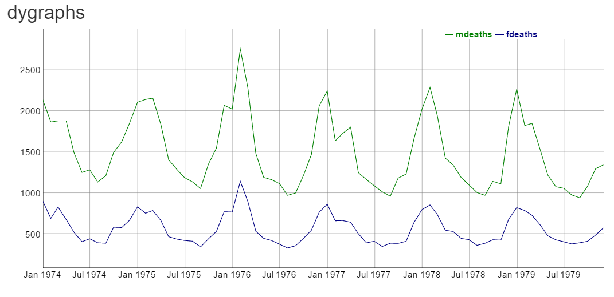
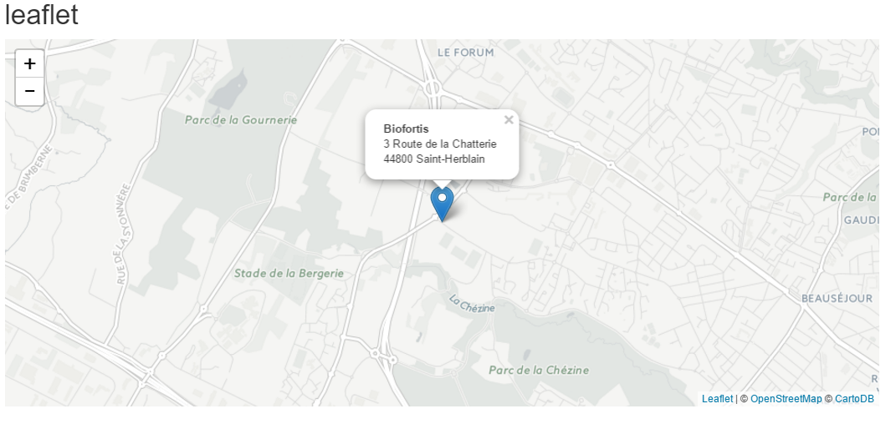
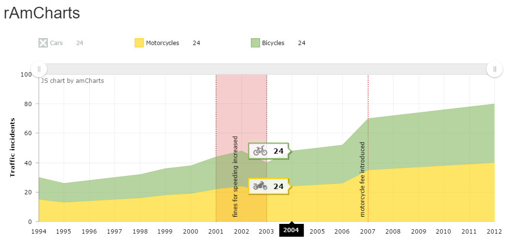
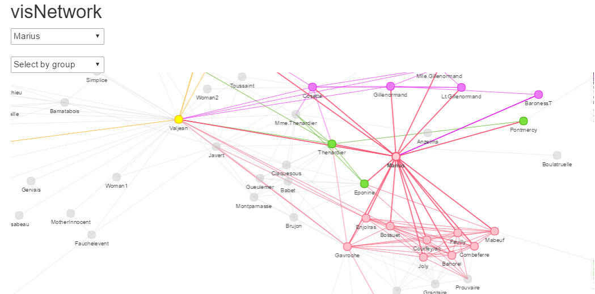
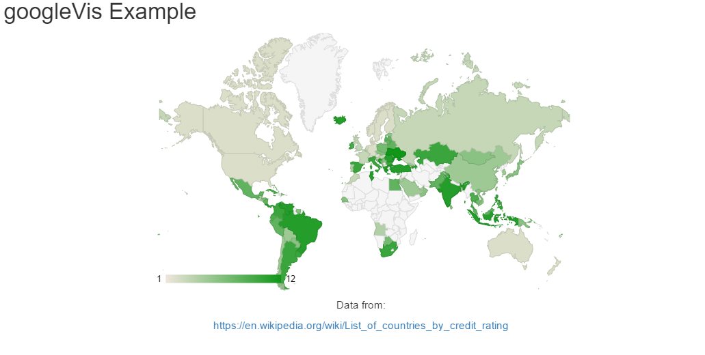
```

# Isolation

## Définition

Par défaut, les outputs et les expressions réactives se mettent à jour automatiquement quand un des inputs présents dans le code change de valeur. Dans certains cas, on aimerait pouvoir contrôler plus finement ce rafraichissement. Par exemple, pour utiliser un bouton de validation (`actionButton) afin de déclencher la mise à jour de l'interface.

Un **input** peut être isolé comme comme suit: `isolate(input$id)`. De même, un **bloc d'instructions** peut être isolé avec la notation suivante `isolate({expr})` (utilisation d'accolades ``{}``).

## Exemple 1

- __ui.r__: 

Trois inputs : __color__ et __bins__ pour l'histogramme, et un __actionButton__ :

```{r, echo = TRUE, eval = FALSE}
shinyUI(fluidPage(
  titlePanel("Isolation"),
  sidebarLayout(
    sidebarPanel(
      radioButtons(inputId = "col", label = "Choose a color", inline = TRUE,
                   choices = c("red", "blue", "darkgrey")),
      sliderInput("bins", "Number of bins:", min = 1, max = 50, value = 30),
      actionButton("go_graph", "Update !")
    ),
    mainPanel(plotOutput("distPlot"))
  )
))
```

- __server.r__: 

On isole tout le code sauf  l'__actionButton__ :

```{r, echo = TRUE, eval = FALSE}
shinyServer(function(input, output) {
  output$distPlot <- renderPlot({
    input$go_graph
    isolate({
      inputColor <- input$color
      x <- faithful[, 2]
      bins <- seq(min(x), max(x), length.out = input$bins + 1)
      hist(x, breaks = bins, col = inputColor, border = 'white')
    })
  })
})
```

L'histogramme sera donc mis à jour quand l'utilisateur cliquera sur le bouton.

```{r, out.width='70%', dpi=220, fig.align='center', echo=FALSE}
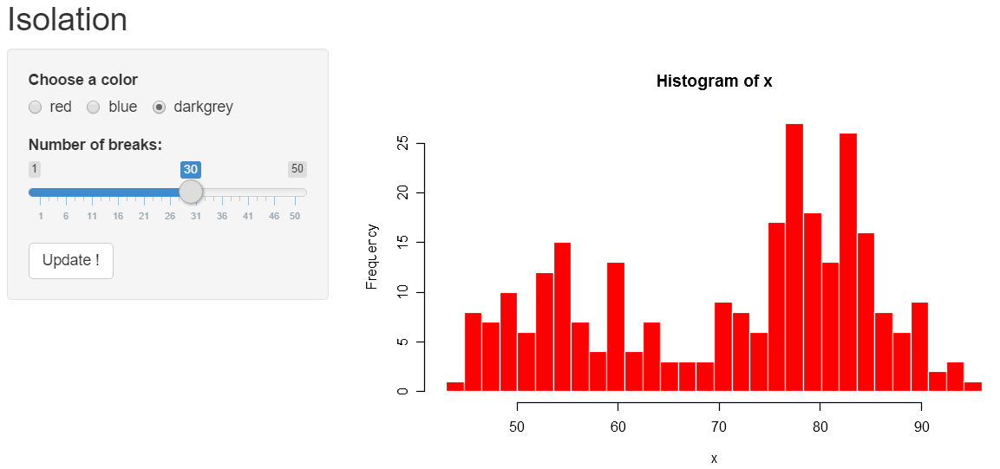
```


## Exemple 2

- __server.r__: 

```{r, echo = TRUE, eval = FALSE}
output$distPlot <- renderPlot({
  input$go_graph
  inputColor <- input$color
  isolate({
    x <- faithful[, 2]
    bins <- seq(min(x), max(x), length.out = input$bins + 1)
    hist(x, breaks = bins, col = inputColor, border = 'white')
  })
})
```

Même résultat en isolant seulement le troisième et dernier input : ``input$bins``.

```{r, echo = TRUE, eval = FALSE}
input$go_graph
x <- faithful[, 2]
bins <- seq(min(x), max(x), length.out = isolate(input$bins) + 1)
hist(x, breaks = bins, col = input$color, border = 'white')
```

L'histogramme sera mis à jour quand l'utilisateur cliquera sur le bouton __ou__ quand la couleur changera.

# Principe des expressions réactives

Les expressions réactives sont très utiles quand on souhaite utiliser le même résultat/objet dans plusieurs outputs en ne faisant le calcul qu'une fois. Il suffit pour cela d'utiliser la fonction ``reactive()`` dans le __server.R__.

Par exemple, nous voulons afficher deux graphiques à la suite d'une ACP: 

* la projection des individus ;
* la projection des variables.

## Exemple sans expression réactive

* __server.R__: le calcul est réalisé deux fois...

```{r, echo = TRUE, eval = FALSE}
require(FactoMineR) ; data("decathlon")

output$graph_pca_ind <- renderPlot({
  res_pca <- PCA(decathlon[ ,input$variables], graph = FALSE)
  plot.PCA(res_pca, choix = "ind", axes = c(1,2))
})

output$graph_pca_var <- renderPlot({
  res_pca <- PCA(decathlon[,input$variables], graph = FALSE)
  plot.PCA(res_pca, choix = "var", axes = c(1,2))
})
```

## Exemple avec expression réactive

* __server.R__ : le calcul n'est maintenant effectué qu'une seule fois !

```{r, echo = TRUE, eval = FALSE}
require(FactoMineR) ; data("decathlon")

res_pca <- reactive({
  PCA(decathlon[,input$variables], graph = FALSE)
})

output$graph_pca_ind <- renderPlot({
  plot.PCA(res_pca(), choix = "ind", axes = c(1,2))
})

output$graph_pca_var <- renderPlot({
  plot.PCA(res_pca(), choix = "var", axes = c(1,2))
})
```

## Quelques remarques

- Une expression réactive va nous faire gagner du temps et de la mémoire.

- __Utiliser des expressions réactives seulement quand cela dépend d'inputs__ (pour d'autres variables : http://shiny.rstudio.com/articles/scoping.html).

- Elle se comporte comme un output standard : mis à jour chaque fois qu'un input présent dans le code change.

- Elle se comporte comme comme un input dans un _renderXX_ : l'output est mis à jour quand l'expression réactive change.

- On récupère sa valeur comme un appel à une fonction, avec des parenthèses d'appel \og `mon_objet_reactif()`\fg.

## Objets réactifs: \og `reactiveValues`\fg

Il existe une alternative à l'utilisation de ``reactive()`` avec ``reactiveValues()``. Cette fonction permet d'initialiser une liste d'objets réactifs, un peu comme la liste des inputs. On va ensuite pouvoir modifier la valeur des objets avec des ``observe`` ou des ``observeEvent``.

```{r, echo = TRUE, eval = FALSE}
# server.R
rv <- reactiveValues(data = rnorm(100)) # init
# update
observeEvent(input$norm, { rv$data <- rnorm(100) })   
observeEvent(input$unif, { rv$data <- runif(100) 
# plot
output$hist <- renderPlot({hist(rv$data)}) 
```


```{r, echo = TRUE, eval = FALSE}
shinyApp(ui = fluidPage(
  actionButton(inputId = "norm", label = "Normal"),
  actionButton(inputId = "unif", label = "Uniform"),
  plotOutput("hist")
), 
server = function(input, output) { 
  rv <- reactiveValues(data = rnorm(100)) 
  observeEvent(input$norm, { rv$data <- rnorm(100) })   
  observeEvent(input$unif, { rv$data <- runif(100) }) 
  output$hist <- renderPlot({ hist(rv$data) }) 
})
```


```{r, out.width='80%', dpi=220, fig.align='center', echo=FALSE}
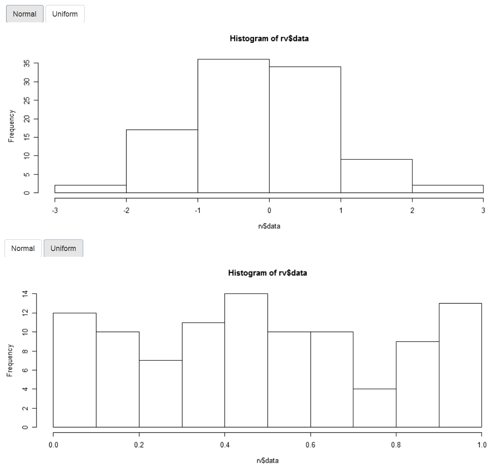
```


# Observe & fonctions d'update

## Introduction

Il existe une série de fonctions pour mettre à jour les inputs et certaines structures, les fonctions commencent par ``updateXX``. On les utilise généralement à l'intérieur d'un ``observe({expr})`` dont la syntaxe est similaire à celle des fonctions de création.

__Attention__ : il est nécessaire d'ajouter un argument __session__  dans la définition de la fonction du serveur.

```{r, echo = TRUE, eval = FALSE}
shinyServer(function(input, output, session) {...})
```

Sur des inputs :

- __updateCheckboxGroupInput__
- __updateCheckboxInput__
- __updateDateInput	Change__ 
- __updateDateRangeInput__
- __updateNumericInput__
- __updateRadioButtons__ 
- __updateSelectInput__ 
- __updateSelectizeInput__
- __updateSliderInput__
- __updateTextInput__	

Pour changer dynamiquement l'onglet sélectionné :

- __updateNavbarPage__,  __updateNavlistPanel__, __updateTabsetPanel__

## Exemple sur un input

```{r, echo = TRUE, eval = FALSE}
shinyUI(fluidPage(
  titlePanel("Observe"),
  sidebarLayout(
    sidebarPanel(
      radioButtons(inputId = "id_dataset", label = "Choose a dataset", inline = TRUE,
                   choices = c("cars", "iris", "quakes"), selected = "cars"),
      selectInput("id_col", "Choose a column", choices = colnames(cars)),
      textOutput(outputId = "txt_obs")
    ),
    mainPanel(fluidRow(
      dataTableOutput(outputId = "dataset_obs")
    ))
  )
))
```


```{r, echo = TRUE, eval = FALSE}
shinyServer(function(input, output, session) {
  dataset <- reactive(get(input$id_dataset, "package:datasets"))
  
  observe({
    updateSelectInput(session, inputId = "id_col", label = "Choose a column",
                      choices = colnames(dataset()))
  })
  
  output$txt_obs <- renderText(paste0("Selected column : ", input$id_col))
  
  output$dataset_obs <- renderDataTable(
    dataset(),
    options = list(pageLength = 5)
  )
})
```

```{r, out.width='90%', dpi=220, fig.align='center', echo=FALSE}
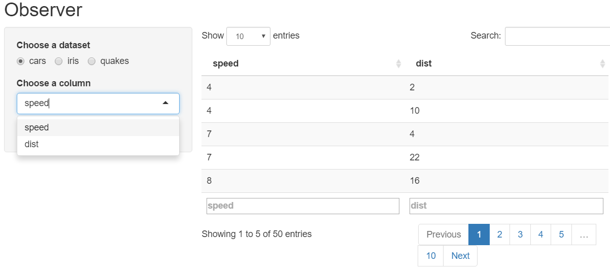
```

```{r, out.width='90%', dpi=220, fig.align='center', echo=FALSE}
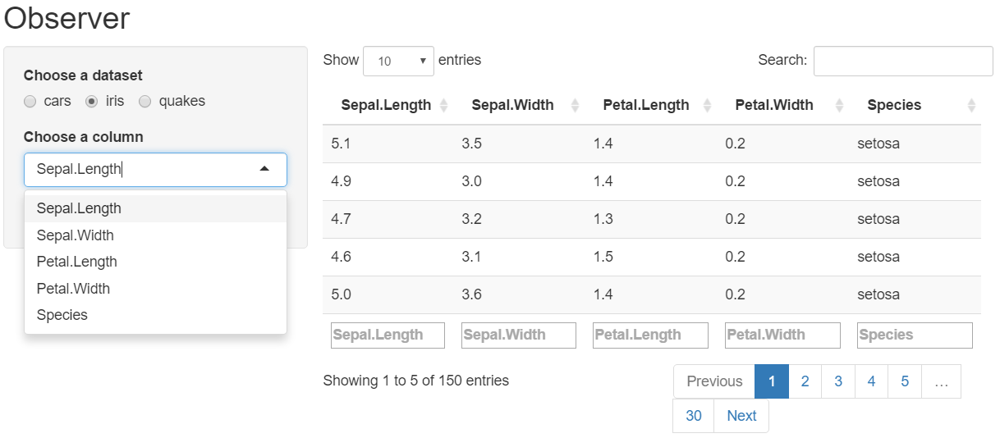
```


##  Exemple sur des onglets 

__Il faut rajouter un identifiant dans la structure (attribut id). __

```{r, echo = TRUE, eval = FALSE}
shinyUI(
  navbarPage(
    id = "idnavbar", # need an id for oberve & update
    title = "A NavBar",
    tabPanel(title = "Summary",
             actionButton("goPlot", "Go to plot !")),
    tabPanel(title = "Plot",
             actionButton("goSummary", "Go to Summary !"))
    
  )
)
```


```{r, echo = TRUE, eval = FALSE}
shinyServer(function(input, output, session) {
  observe({
    input$goPlot
    updateTabsetPanel(session, "idnavbar", selected = "Plot")
  })
  observe({
    input$goSummary
    updateTabsetPanel(session, "idnavbar", selected = "Summary")
  })
})
```

## Observeur: \og `observeEvent`\fg

Une variante de la fonction ``observe()`` est disponible avec la fonction ``observeEvent()``. On définit alors de façon explicite l'espression qui représente l'événement __et__ l'expression qui sera éxécutée quand l'événement se produit.

```{r, echo = TRUE, eval = FALSE}
# avec un observe
observe({
  input$goPlot
  updateTabsetPanel(session, "idnavbar", selected = "Plot")
})

# idem avec un observeEvent
observeEvent(input$goSummary, {
  updateTabsetPanel(session, "idnavbar", selected = "Summary")
})
```


# Affichage conditionnel : \og`conditionalPanel`\fg

Il est possible d'afficher conditionnellement ou non certains éléments :  

```
conditionalPanel(condition = [...], )
```

La condition peut se faire sur des inputs ou des outputs. Elle doit impérativement être rédigée en __Javascript__\dots

```
conditionalPanel(condition = "input.checkbox == true", [...])
```


```{r, eval = FALSE, echo = TRUE}
library(shiny)
shinyApp(
  ui = fluidPage(
    fluidRow(
      column(
        width = 4,
        align = "center",
        checkboxInput("checkbox", "View other inputs", value = FALSE)
      ),
      column(
        width = 8,
        align = "center",
        conditionalPanel(
          condition = "input.checkbox == true", 
          sliderInput("slider", "Select value", min = 1, max = 10, value = 5),
          textInput("txt", "Enter text", value = "")
        )
      )
    )
  ),
  server = function(input, output) {}
)
```

```{r, out.width='90%', dpi=220, fig.align='center', echo=FALSE}
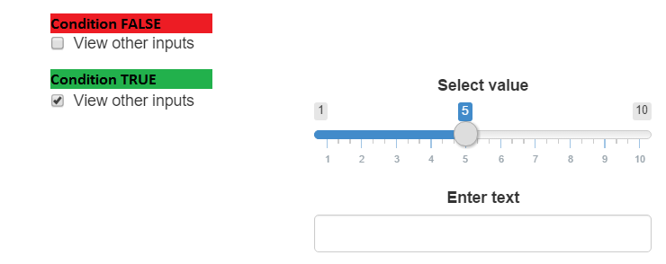
```


# Débogage

## Affichage console

Un des premiers niveaux de débogage est l'utilisation de ``print`` console au sein de l'application shiny. Bien que déconseillé, cela permet d'afficher des informations lors du développement et/ou de l'éxécution de l'application. Dans __shiny__, on utilisera de préférence ``cat(file=stderr(), ...)`` pour être sûr que l'affichage marche dans tous les cas d'outputs, et également dans les logs avec __shiny-server__.

```{r, eval = FALSE}
output$distPlot <- renderPlot({
  x <- iris[, input$variable]
  cat(file=stderr(), class(x)) # affichage de la classe de x
  hist(x)
})
```

```{r, out.width='90%', dpi=220, fig.align='center', echo=FALSE}
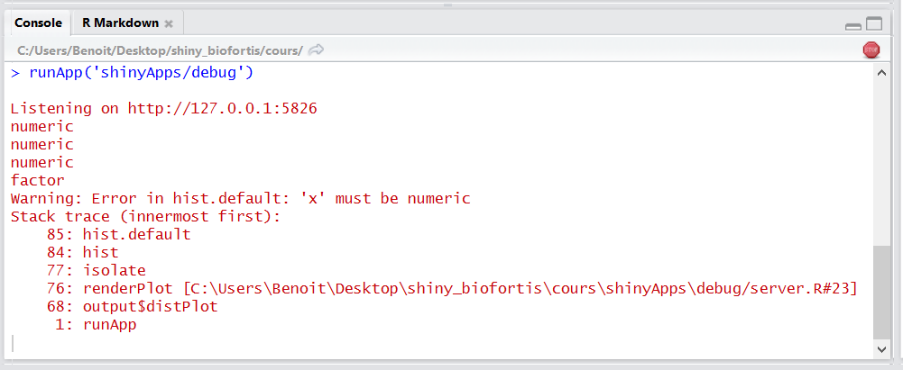
```

__Remarque importante__: bien que largement répandue, nous recommandons d'abandonner cette pratique au profit de l'utilisation de point(s) d'arrêt(s) lorsqu'il s'agit de rechercher des anomalies lors du développement. Lorsque l'instruction sera exécutée, l'application s'arrêtera et vous serez renvoyé à la console __R__ où il sera possible d'inspecter tous les objets disponibles\dots{} Très utiles, les points d'arrêt présentent l'avantage de ne pas nécessiter l'ajout d'instruction(s) dans le code (pas de risque d'oubli, la \og stack trace\fg{} n'est pas polluée).

## Lancement manuel d'un browser

- On peut insérer le lancement d'un ``browser()`` à n'importe quel moment.
- On pourra alors observer les différents objets et avancer pas-à-pas.

```{r, eval = FALSE}
output$distPlot <- renderPlot({
  x <- iris[, input$variable]
  browser() # lancement du browser
  hist(x)
})
```

- Ne pas oublier de l'enlever une fois le développement terminé...!

```{r, out.width='90%', dpi=220, fig.align='center', echo=FALSE}
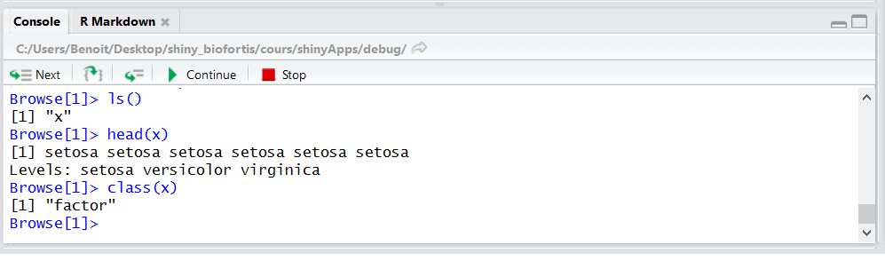
```

## Lancement automatique d'un browser

L'option ``options(shiny.error = browser)`` permet de lancer un ``broswer()`` automatiquement lors de l'apparition d'une erreur :

```{r, eval = FALSE}
options(shiny.error = browser)
```

## Mode \og showcase\fg

En lançant une application avec l'option  ``display.mode="showcase"`` et l'utilisation de la fonction ``runApp()``, 
on peut observer en direct l'éxécution du code :

```{r, eval = FALSE}
runApp("path/to/myapp", display.mode="showcase")
```

```{r, out.width='90%', dpi=220, fig.align='center', echo=FALSE}
knitr::include_graphics("img/debug_showcase.png")
```

## Reactive log

- En activant l'option ``shiny.reactlog``, on peut visualiser à tous instants les dépendances et les flux entre les objets réactifs de __shiny__ :

  + soit en tappant ``ctrl+F3`` dans le navigateur web ;
  + soit en insérant ``showReactLog()`` au-sein du code shiny.

```{r, eval = FALSE}
options(shiny.reactlog=TRUE) 

output$distPlot <- renderPlot({
  x <- iris[, input$variable]
  showReactLog() # launch shiny.reactlog
  hist(x)
}) 
```

```{r, out.width='90%', dpi=220, fig.align='center', echo=FALSE}
knitr::include_graphics("img/debug_log.png")
```

## Communication client/server

Toutes les communications entre le client et le serveur sont visibles en utilisant l'option ``shiny.trace``.

```{r, eval = FALSE}
options(shiny.trace = TRUE) 
```

```{r, out.width='90%', dpi=220, fig.align='center', echo=FALSE}
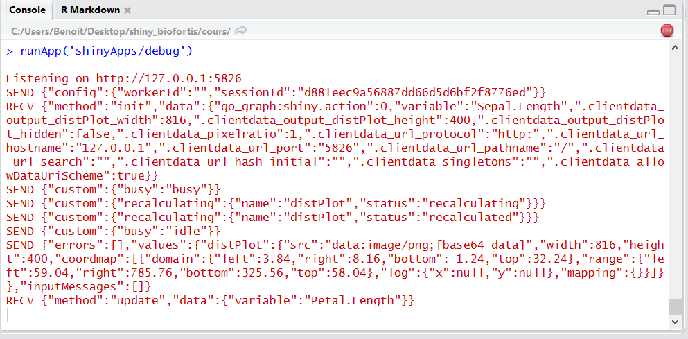
```

## Traçage des erreurs

- Depuis ``shiny_0.13.1``, on récupère la \og stack trace\fg quand une erreur se produit.
- Si besoin, on peut récupérer une \og stack trace\fg encore plus complète, comprenant les différentes fonctions internes, avec ``options(shiny.fullstacktrace = TRUE)``.


```{r, eval = FALSE}
options(shiny.fullstacktrace = TRUE)
```

```{r, out.width='90%', dpi=220, fig.align='center', echo=FALSE}
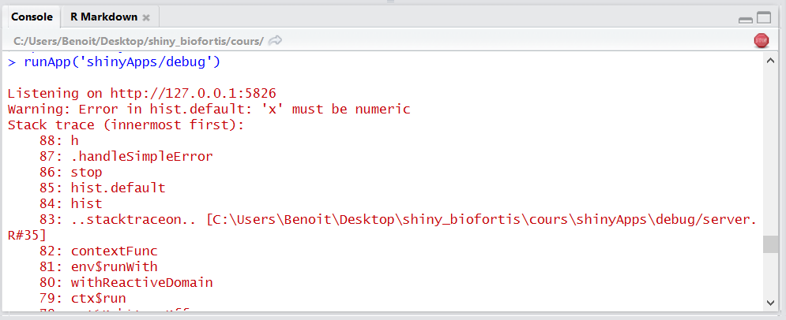
```

# Quelques bonnes pratiques

- Préférer l'underscore (_) au point (.) comme séparateur dans le nom des variables. En effet, le **.** peut amener de mauvaises interactions avec d'autres langages, comme le __Javascript__.
- Faire bien attention à __l'unicité des différents identifiants__ des inputs/outputs.
- Pour éviter des problèmes éventuels avec __des versions différentes de packages__, et notamment dans le cas de __plusieurs applications shiny__ et/ou différents environnements de travail, essayer d'utiliser _packrat_ (https://rstudio.github.io/packrat/).
- Mettre toute la __partie \og calcul\fg{}__ dans des __fonctions/un package__ et effectuer des tests (cf. http://r-pkgs.had.co.nz/tests.html).
- Diviser la partie __ui.R__ et __server.R__ en plusieurs scripts, un par onglet par exemple :

```{r, echo = TRUE, eval = FALSE}
# ui.R
shinyUI(
  navbarPage("Divide UI & SERVER",
    source("src/ui/01_ui_plot.R", local = TRUE)$value,
    source("src/ui/02_ui_data.R", local = TRUE)$value
  )
)
# server.R
shinyServer(function(input, output, session) {
  source("src/server/01_server_plot.R", local = TRUE)
  source("src/server/02_server_data.R", local = TRUE)
})
```

# Quelques mots sur shiny-server

On peut déployer en interne nos applications shiny en installant un shiny-server (https://www.rstudio.com/products/shiny/shiny-server2/). 

- Uniquement sur linux : ubuntu 12.04+, RedHat/CentOS 5+, SUSE Enterprise Linux 11+
- Version gratuite : déployer plusieurs applications __shiny__
- Version payante : 
    + authentification ;
    + ressources par applications (nombre de coeurs, mémoire, ...) ;
    + monitoring.

Une fois le serveur installé, il suffit de déposer les applications dans le répertoire dédié, et elles deviennent directement accessibles via l'adresse \og server:port_ou_redirection/nom_du_dossier\fg.

```{r, out.width='60%', dpi=220, fig.align='center', echo=FALSE}
knitr::include_graphics("img/SS1.png")
knitr::include_graphics("img/SS2.png")
knitr::include_graphics("img/SS3.png")
```

Des logs sont alors disponibles sous la forme de ``print console`` :

```{r, out.width='60%', dpi=220, fig.align='center', echo=FALSE}
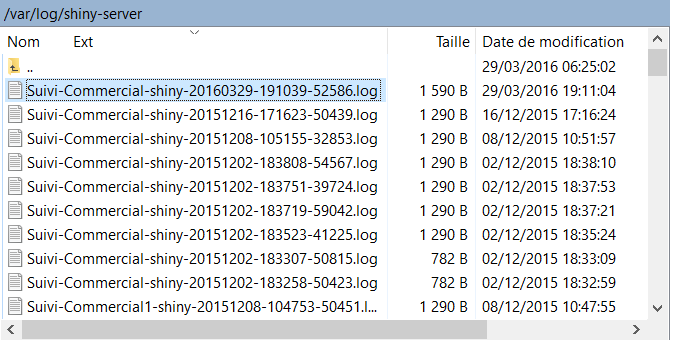
```

## Références / Tutoriaux / Exemples

* http://shiny.rstudio.com/
* http://shiny.rstudio.com/articles/
* http://shiny.rstudio.com/tutorial/
* http://shiny.rstudio.com/gallery/
* https://www.rstudio.com/products/shiny/shiny-user-showcase/
* http://www.showmeshiny.com/


